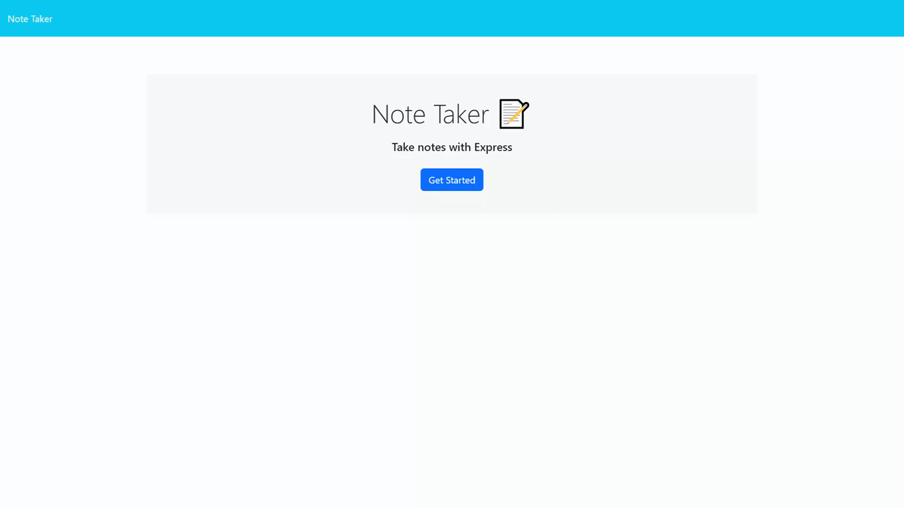

# Note Taker

## Description

Note Taker is an application that allows users to write and save notes. This application uses an Express.js back end and retrieves and stores note data from a JSON file.

The goal of this project is to build the back end of the application, connect it to the front end, and deploy the entire application to Heroku. By completing this challenge, I gained practical experience with key web development technologies such as Express.js, routing, and working with JSON data.

Completing the Note Taker challenge and deploying it on Heroku has been a great experience for me as a web developer. It has not only helped me build a functional note-taking application, but it has also provided me with practical experience in working with both front-end and back-end technologies. Through this project, I have been able to develop my problem-solving skills, gain experience in handling database connectivity, and routing. Overall, this project has been a significant step forward in my development as a web developer, and it has prepared me for future web development challenges.

## Table of Contents

- [Acceptance Criteria](#acceptance-criteria)
- [Installation](#installation)
- [Usage](#usage)
- [Technologies Used](#technologies-used)
- [Contributing](#contributing)
- [License](#license)
- [Links](#links)

## Acceptance Criteria

GIVEN a note-taking application 
WHEN I open the Note Taker 
THEN I am presented with a landing page with a link to a notes page 
WHEN I click on the link to the notes page 
THEN I am presented with a page with existing notes listed in the left-hand column, plus empty fields to enter a new note title and the note’s text in the right-hand column 
WHEN I enter a new note title and the note’s text 
THEN a Save icon appears in the navigation at the top of the page 
WHEN I click on the Save icon 
THEN the new note I have entered is saved and appears in the left-hand column with the other existing notes 
WHEN I click on an existing note in the list in the left-hand column 
THEN that note appears in the right-hand column 
WHEN I click on the Write icon in the navigation at the top of the page 
THEN I am presented with empty fields to enter a new note title and the note’s text in the right-hand column 

## Installation

To install Note Taker, follow these steps:

1. Clone the repository to your local machine.
2. Navigate to the root directory of the repository in your terminal.
3. Run the command `npm install` to install the required dependencies.

## Usage

To use Note Taker, navigate to the root directory of the repository in your terminal and run the command `node server.js`. Open your browser and go to `http://localhost:3001` to access the application. From there, you can write and save notes.

## Technologies Used

- Express.js
- Node.js
- UUID

## Contributing

Contributions to Note Taker are welcome! To contribute, please follow these steps:

1. Fork the repository to your own Github account.
2. Clone the repository to your local machine.
3. Create a branch with your proposed changes.
4. Commit your changes to the new branch.
5. Push your changes to your forked repository.
6. Submit a pull request to the main repository with a description of your changes.

## License

This project is licensed under the MIT License - see the [LICENSE](./LICENSE) file for details. 

## Links
- [Repository](https://github.com/seantamturk/note-taker)
- [Website](https://note-taker-seantamturk.herokuapp.com/)
- [Linkedin](https://www.linkedin.com/in/sean-tamturk-8253b722a/)